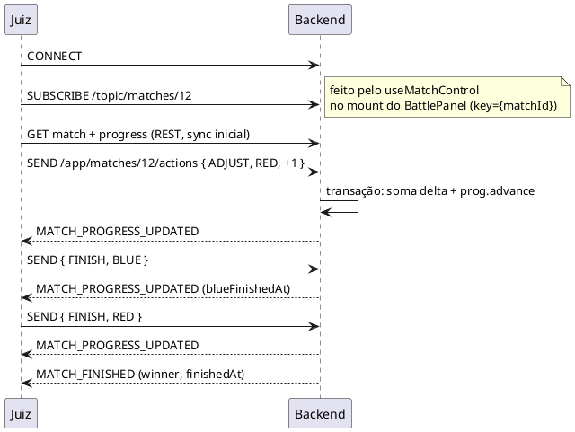

# WebSocket — ações de juiz em tempo real

Substitui o `PUT /matches/{id}/reps` para ajustes durante o match. CRUD, sync inicial e ecrã espectador (SSE) ficam como estão.

## Canais (STOMP)

```
/app/matches/{mid}/actions   → entrada (juiz)
/topic/matches/{mid}         → saída (broadcast a todos os subscritos, incluindo erros)
```

## Mensagens

**Input:**
```json
{ "action": "ADJUST", "side": "RED", "delta": 1 }
{ "action": "FINISH", "side": "BLUE" }
```

**Output:**
```json
{ "type": "MATCH_PROGRESS_UPDATED", "matchId": 12,
  "progress": { "redCurrentReps": 15, "blueCurrentReps": 9, "redFinishedAt": null,
                "blueFinishedAt": null, "redCurrentExerciseId": 42,
                "blueCurrentExerciseId": 42, "timerStartedAt": "2026-08-22T15:04:02Z" } }

{ "type": "MATCH_FINISHED", "matchId": 12,
  "winnerAthleteId": 8, "finishedAt": "2026-08-22T15:07:44Z" }

{ "type": "ERROR", "code": "MATCH_NOT_RUNNING" }
```

`MATCH_FINISHED` é emitido quando ambos os lados acabam (o service já grava status/winner/finishedAt — ver `MatchService.updateAthletesReps`). O servidor resolve `matchId → tournamentId` internamente para manter a ponte SSE do espectador.

## Diagrama



## Lógica do cliente

Sem ack privado — a confirmação é o próprio broadcast:

| Evento | Ação |
|---|---|
| clicou +1 | bump otimista local + SEND |
| `MATCH_PROGRESS_UPDATED` | reconcilia com valores do servidor |
| `ERROR` | rollback + mostra erro |
| silêncio > ~1s | rollback + GET `/matches/{id}/progress` (resync) |

Subscrição vive no `useMatchControl`: monta → subscreve, desmonta → limpa (o `key={matchId}` do `BattlePanel` trata dos casos de troca de match).

## Notas

- Deltas (não valores absolutos) eliminam conflito entre juízes concorrentes.
- Auth: token + role JUDGE validados no handshake HTTP (`HandshakeInterceptor`, query params `token`/`matchId`; rejeição com 401/403 antes do upgrade). O handler não recebe o user — quem liga já é um juiz por construção.
- Trade-off aceite: o bracket de *outros* juízes não atualiza em tempo real (o próprio atualiza via callback). Se um dia for requisito, adiciona-se `/topic/tournaments/{tid}` sem mexer neste contrato.
